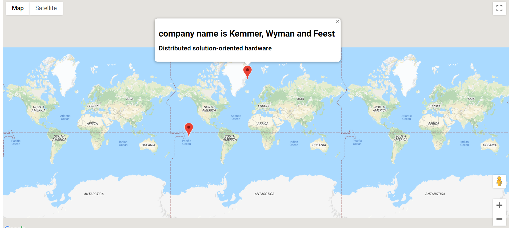

### What is this project
This project i created as a part of online course.In this i have
used html,css and typescript.This project shows company and user
location on google maps.To run this project execute 
parcel index.html command

### Learnings from this project

* With the help of pracel bundlder we can refer typescript file from html file
* Faker module of npm
* Sometimes type definitions need to be installed when u are using a javascript 
  project inside typescript code.
* way to install type definition: npm install @types/faker.Here we installed 
  type definition for faker package
* type definition generally has .d.ts extension
* generally default is not used wd export in typescript world..this way u have to 
  import with curly braces always.This rule doesnt apply to 3rd party modules
* Hook up Google Maps by generating an API key on the Google Developer's
  Console.Creating an API key requires a Google Developer account with billing enabled.This means you have to have a credit card tied to your Google account.  
* learnt about how to add markers to map and read type definition files
* using interface to restrict what type of param can be send to a method
* learnt how to add info windows on map markers
* implementing interface on a class.. 
* export interface works in same way as class
* Restricting access to what engineers can change and what they cant change..
  using public protected private modifiers
* we can use html tags also in template strings  

## Screenshot of project

  

